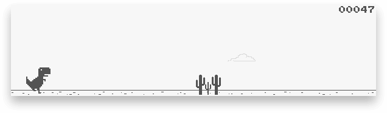

<h1 align="center">
  <br>
  <a href="https://chrisdothtml.github.io/chrome-dino" target="_blank"></a>
  <br>
  <br>
</h1>

> Remaking the chrome offline dinosaur game

Note that this was previously written with p5.js but has since been refactored into a dependency-free approach. You can still see the old p5.js implementation in [the p5js branch](https://github.com/chrisdothtml/chrome-dino/tree/p5js).

## Run locally (literally)

```bash
# install deps
$ yarn
# start server
$ yarn start
```

## License

[MIT](license)
